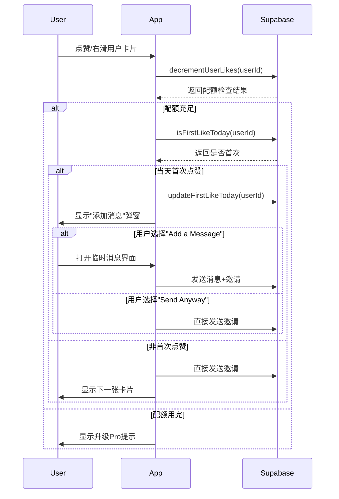

# 首次点赞提示功能实现总结

## 📋 需求变更

**原需求**: 30% 随机概率触发"添加消息"提示弹窗

**新需求**: 用户当天首次点赞/右滑时触发提示弹窗

## ✅ 已完成的工作

### 1. 数据库修改
创建了 `add_first_like_today_column.sql` 文件：
- 在 `users` 表添加 `first_like_today` 字段（DATE 类型）
- 添加索引以提升查询性能
- 包含验证查询和示例

### 2. 后端服务 (SupabaseService.swift)
添加了两个新函数：

#### `isFirstLikeToday(userId: String) -> Bool`
- 检查用户是否在当天已经点赞过
- 读取 `first_like_today` 字段
- 比较存储的日期与当前日期
- 返回 `true` 表示是当天首次，`false` 表示已经点赞过

#### `updateFirstLikeToday(userId: String)`
- 更新用户的 `first_like_today` 字段为当前日期
- 在首次点赞检测为 `true` 后立即调用
- 确保后续点赞不再触发弹窗

### 3. 前端修改

#### BrewNetMatchesView.swift
- 移除随机概率逻辑 (`Double.random(in: 0...1) < 0.3`)
- 添加首次点赞检查逻辑
- 在 `likeProfile()` 函数中调用 `isFirstLikeToday()`
- 如果是首次，调用 `updateFirstLikeToday()` 并显示弹窗

#### ExploreView.swift
- 移除随机概率逻辑
- 添加首次点赞检查逻辑
- 在 `handleCoffeeChatConnect()` 函数中实现相同机制

#### CategoryRecommendationsView.swift
- 移除随机概率逻辑
- 添加首次点赞检查逻辑
- 在 `likeProfile()` 函数中实现相同机制

### 4. 文档更新
更新了 `ADD_MESSAGE_PROMPT_FEATURE.md`：
- 修改触发机制说明
- 更新用户流程图
- 添加数据库字段说明
- 更新技术实现细节
- 添加部署步骤
- 完善测试建议

## 🔄 工作流程



## 📊 数据结构

### users 表新增字段

| 字段名 | 类型 | 可空 | 说明 |
|--------|------|------|------|
| first_like_today | DATE | YES | 用户当天首次点赞的日期 (YYYY-MM-DD) |

### 数据示例

| user_id | first_like_today | 说明 |
|---------|------------------|------|
| user_123 | 2024-01-15 | 用户在1月15日点赞过 |
| user_456 | NULL | 用户从未点赞过 |
| user_789 | 2024-01-14 | 用户上次点赞是1月14日 |

## 🧪 测试场景

### 场景 1: 新用户首次点赞
```
状态: first_like_today = NULL
操作: 用户点赞
预期: 
  1. 显示弹窗
  2. first_like_today 更新为今天
  3. 用户可选择添加消息或直接发送
```

### 场景 2: 当天第二次点赞
```
状态: first_like_today = 今天日期
操作: 用户再次点赞
预期: 
  1. 不显示弹窗
  2. first_like_today 保持不变
  3. 直接发送邀请
```

### 场景 3: 隔天首次点赞
```
状态: first_like_today = 昨天日期
操作: 用户点赞
预期: 
  1. 显示弹窗
  2. first_like_today 更新为今天
  3. 用户可选择添加消息或直接发送
```

### 场景 4: 配额用完
```
状态: likes_remaining = 0
操作: 用户点赞
预期: 
  1. 不检查首次点赞
  2. 直接显示"升级Pro"提示
  3. first_like_today 不变
```

## 🚀 部署清单

- [x] 创建 SQL 脚本
- [x] 修改 SupabaseService
- [x] 修改三个视图文件
- [x] 更新文档
- [ ] **运行 SQL 脚本在 Supabase 数据库**
- [ ] 测试数据库字段
- [ ] 本地测试功能
- [ ] 推送代码到远程仓库
- [ ] 部署到生产环境
- [ ] 监控功能表现

## 📈 预期效果

1. **用户教育**: 每个用户每天至少看到一次提示，了解添加消息的好处
2. **不打扰用户**: 每天只提示一次，不影响后续使用流畅度
3. **提高消息率**: 预计带消息的邀请占比提升
4. **提升接受率**: 个性化消息预计提高邀请接受率

## 🔍 监控指标

建议跟踪以下数据：
- 弹窗显示次数（应该约等于日活用户数）
- 用户选择"Add a Message"的比例
- 用户选择"Send Anyway"的比例
- 带消息的邀请接受率 vs 不带消息的邀请接受率
- 功能上线前后的整体消息发送率变化

## ⚠️ 注意事项

1. **时区问题**: 
   - 当前实现使用设备本地时区
   - 确保 Supabase 返回的日期格式正确
   - 日期比较使用 `Calendar.current.startOfDay(for:)` 避免时间部分影响

2. **数据迁移**:
   - 现有用户的 `first_like_today` 字段为 NULL
   - 首次使用新功能时会触发弹窗（符合预期）

3. **性能考虑**:
   - 添加了索引以优化查询性能
   - 每次点赞多两次数据库调用（检查+更新）
   - 影响较小，可接受

4. **边界情况**:
   - 用户跨时区旅行：使用设备本地时区，可能导致一天内多次触发
   - 网络错误：已有错误处理机制
   - 数据库字段缺失：SQL 脚本使用 `IF NOT EXISTS` 确保安全

## 🎯 下一步

1. 在 Supabase 数据库中运行 SQL 脚本
2. 本地测试所有场景
3. 提交代码并推送到远程仓库
4. 部署到测试环境验证
5. 监控数据，收集用户反馈
6. 根据数据优化策略

